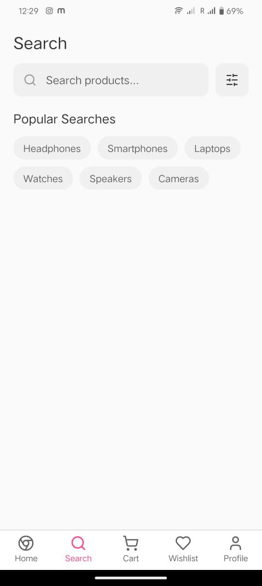
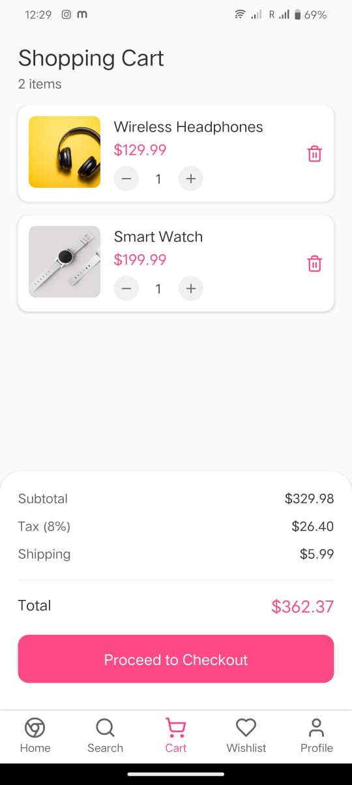
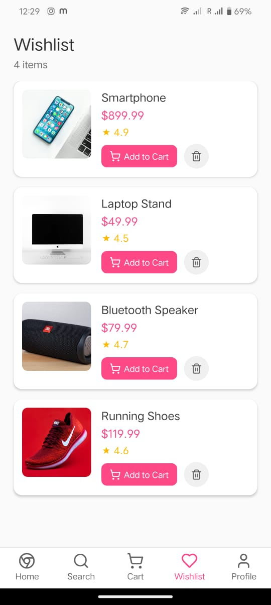
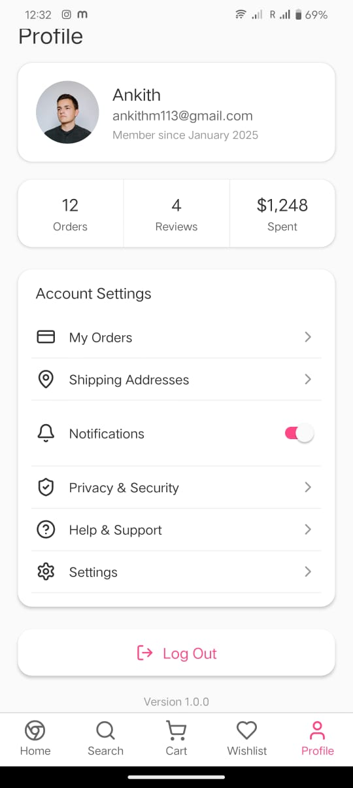

# Savvy Shopper

Savvy Shopper is a mobile application built with Expo and React Native, designed to provide a seamless shopping experience. The app leverages modern technologies such as Expo Router for navigation and includes a rich set of features powered by popular React Native libraries.

## Project Overview

- **Project Name:** Savvy Shopper
- **Version:** 1.0.0
- **Platform:** iOS, Android, and Web (via Expo)
- **Orientation:** Portrait
- **Main Technologies:** React Native, Expo, TypeScript, Expo Router


## Sample UI








## Prerequisites

- Node.js (recommended version 16 or later)
- npm (comes with Node.js)
- Expo CLI (install globally via `npm install -g expo-cli`)

## Installation

1. Clone the repository:
   ```bash
   git clone <repository-url>
   cd savvy-shopper
   ```

2. Install dependencies:
   ```bash
   npm install
   ```

## Running the App

To start the development server and launch the app on your device or emulator, run:

```bash
npm run dev
```

This will start the Expo development server with telemetry disabled.

## Building for Web

To build the project for web deployment, run:

```bash
npm run build:web
```

This command exports the web build using Expo's bundler.

## Project Structure

- `app/` - Contains the main application screens and routing setup using Expo Router.
- `assets/` - Static assets such as fonts and images.
- `components/` - Reusable React Native components.
- `app.json` - Expo configuration file.
- `package.json` - Project metadata and dependencies.
- `tsconfig.json` - TypeScript configuration.

## Key Dependencies

- `expo` - Expo SDK for building React Native apps.
- `expo-router` - File-based routing for Expo apps.
- `react-native` - Core React Native framework.
- `typescript` - TypeScript language support.
- Various Expo libraries for fonts, splash screen, haptics, and more.

## Additional Notes

- Custom fonts are included in the `assets/fonts` directory.
- The app supports tablet devices on iOS.
- The project uses the new Expo architecture with typed routes enabled.

## License

This project is licensed under the MIT License.

---

For more information, refer to the Expo documentation: https://docs.expo.dev/

